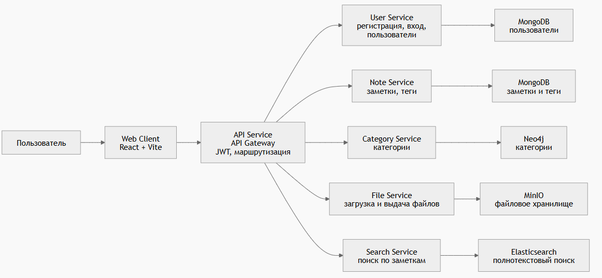

# Note System

Микросервисная система для ведения заметок с категориями, тегами, вложениями и пользовательской авторизацией.

## Что умеет

- регистрация и вход пользователей через `api_service`
- создание и просмотр заметок
- работа с категориями и тегами
- загрузка и скачивание файлов, привязанных к заметкам
- веб-интерфейс на `React + Vite`

## Состав проекта

- `api_service` — единая точка входа, JWT-аутентификация, маршрутизация запросов к сервисам
- `note_service` — заметки и теги, хранение в `MongoDB`
- `user_service` — пользователи и авторизация, хранение в `MongoDB`
- `category_service` — категории, хранение в `Neo4j`
- `file_service` — файловые вложения, хранение в `MinIO`
- `web_client` — клиентское приложение

## Технологии

- `Go` — `api_service`, `note_service`, `user_service`, `file_service`
- `Python + FastAPI` — `category_service`
- `React + Vite` — `web_client`
- `MongoDB`, `Neo4j`, `MinIO`
